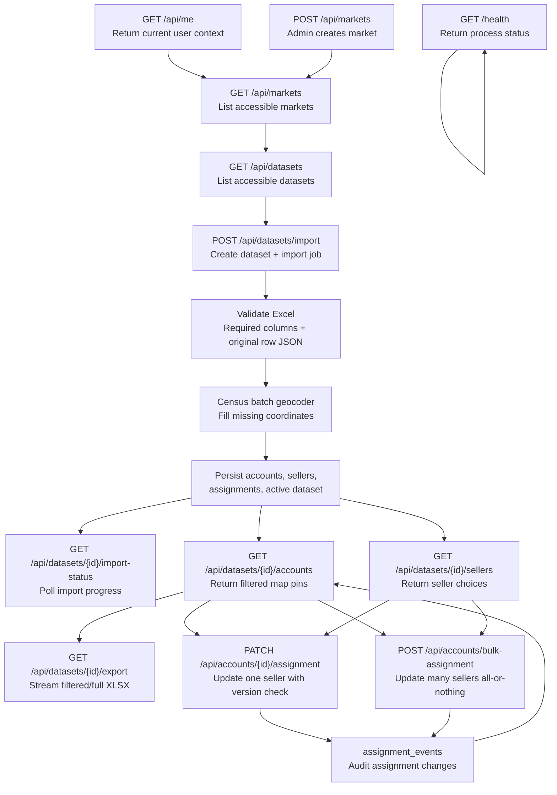

# Sales Territory Mapping Tool

Internal app for importing account Excel files, geocoding account addresses, mapping account pins, saving seller assignments, and exporting updated Excel.

## Structure

```txt
backend/   FastAPI API, import jobs, Postgres/PostGIS models
frontend/  Angular SPA, MapLibre map, MapTiler basemap
plan.md    detailed implementation plan
```

## Backend

```bash
cd backend
uv sync --extra dev
uv run alembic upgrade head
uv run uvicorn app.main:app --reload
```

Local auth is disabled by default through `auth_disabled_for_local_dev=true`.

### Backend API

Base URL: `http://localhost:8000`

All app routes except `/health` live under `/api`. In local development, auth can be bypassed through `auth_disabled_for_local_dev=true`. In authenticated mode, routes use the current user to enforce admin-only operations and market-level access.

Common error shapes:

```json
{ "detail": "Dataset not found" }
```

```json
{
  "detail": {
    "message": "Stale account version",
    "accountId": "0193f8f2-6dc7-7f72-9b7d-a4bb0e5ac111",
    "currentVersion": 4,
    "currentSeller": "Sam Seller"
  }
}
```

#### GET `/health`

Checks process health. Does not touch database.

Request body: none.

Response `200`:

```json
{ "status": "ok" }
```

#### GET `/api/me`

Returns current authenticated user context.

Request body: none.

Response `200`:

```json
{
  "id": "admin@example.com",
  "email": "admin@example.com",
  "name": "Admin User",
  "role": "admin",
  "markets": []
}
```

#### GET `/api/markets`

Lists markets visible to current user. Admin/local-dev users can see all markets. Market-scoped users only see allowed markets.

Request body: none.

Response `200`:

```json
[
  {
    "id": "0193f8f2-6dc7-7f72-9b7d-a4bb0e5ac111",
    "name": "Southern California",
    "region": "West"
  }
]
```

#### POST `/api/markets`

Creates a market. Requires `admin` role.

Request JSON:

```json
{
  "name": "Southern California",
  "region": "West"
}
```

Response `200`:

```json
{
  "id": "0193f8f2-6dc7-7f72-9b7d-a4bb0e5ac111",
  "name": "Southern California",
  "region": "West"
}
```

#### GET `/api/datasets`

Lists datasets visible to current user. Optional `market_id` narrows results and enforces access to that market.

Query params:

| Name | Type | Required | Description |
| --- | --- | --- | --- |
| `market_id` | UUID | no | Return datasets for one market. |

Request body: none.

Response `200`:

```json
[
  {
    "id": "0193f8f2-6dc7-7f72-9b7d-a4bb0e5ac222",
    "name": "Cynthia May Upload",
    "market_id": "0193f8f2-6dc7-7f72-9b7d-a4bb0e5ac111",
    "import_status": "completed",
    "is_active": true,
    "row_count": 200
  }
]
```

#### POST `/api/datasets/import`

Creates a dataset and import job, then starts async Excel parsing/geocoding. Requires `admin` role and market access. Import validates required Excel columns, preserves original row JSON, creates sellers, geocodes missing coordinates with Census batch geocoder, and marks new dataset active on success.

Request content type: `multipart/form-data`

Form fields:

| Name | Type | Required | Description |
| --- | --- | --- | --- |
| `file` | file | yes | Excel workbook, usually `.xlsx`. |
| `marketId` | UUID | yes | Market receiving this dataset. |
| `datasetName` | string | yes | User-facing dataset name. |

Response `202`:

```json
{
  "datasetId": "0193f8f2-6dc7-7f72-9b7d-a4bb0e5ac222",
  "importJobId": "0193f8f2-6dc7-7f72-9b7d-a4bb0e5ac333",
  "status": "queued"
}
```

#### GET `/api/datasets/{dataset_id}/import-status`

Returns latest import job status for a dataset. Requires `admin` role and market access.

Request body: none.

Response `200`:

```json
{
  "datasetId": "0193f8f2-6dc7-7f72-9b7d-a4bb0e5ac222",
  "importJobId": "0193f8f2-6dc7-7f72-9b7d-a4bb0e5ac333",
  "status": "completed_with_warnings",
  "rowCount": 200,
  "processedCount": 200,
  "geocodeSuccessCount": 184,
  "geocodeFailureCount": 16,
  "warnings": [
    "Extra columns preserved but not filterable by default: Priority Tier"
  ]
}
```

Status values currently used: `queued`, `processing`, `completed`, `completed_with_warnings`, `failed`.

#### GET `/api/datasets/{dataset_id}/accounts`

Returns mapped accounts for map rendering or JSON listing. Only accounts with latitude and longitude are returned. Enforces dataset market access.

Query params:

| Name | Type | Required | Description |
| --- | --- | --- | --- |
| `format` | string | no | `geojson` default, any other value returns `{ "accounts": [...] }`. |
| `seller` | string | no | Exact current seller name. |
| `dc` | string | no | Exact DC value. |
| `tire_pros` | boolean | no | Tire Pros flag. |
| `activate` | boolean | no | Activate flag. |
| `primary_program` | string | no | Exact primary program. |
| `secondary_program` | string | no | Exact secondary program. |
| `ttm_min` | number | no | Minimum TTM volume. |
| `ttm_max` | number | no | Maximum TTM volume. |
| `bbox` | string | no | `west,south,east,north` coordinate bounds. |

Response `200`, default GeoJSON:

```json
{
  "type": "FeatureCollection",
  "features": [
    {
      "type": "Feature",
      "id": "0193f8f2-6dc7-7f72-9b7d-a4bb0e5ac444",
      "geometry": {
        "type": "Point",
        "coordinates": [-118.2437, 34.0522]
      },
      "properties": {
        "id": "0193f8f2-6dc7-7f72-9b7d-a4bb0e5ac444",
        "customerNumber": "CUST-1001",
        "accountName": "Acme Tires",
        "currentSeller": "Sam Seller",
        "sellerId": "0193f8f2-6dc7-7f72-9b7d-a4bb0e5ac555",
        "sellerColor": "#2563eb",
        "ttmVolume": 125000.0,
        "tirePros": true,
        "activate": false,
        "primaryProgram": "Gold",
        "secondaryProgram": "Fleet",
        "dc": "LA",
        "version": 3,
        "pinNumber": 1
      }
    }
  ]
}
```

Response `200`, non-GeoJSON:

```json
{
  "accounts": [
    {
      "id": "0193f8f2-6dc7-7f72-9b7d-a4bb0e5ac444",
      "customerNumber": "CUST-1001",
      "accountName": "Acme Tires",
      "currentSeller": "Sam Seller",
      "sellerId": "0193f8f2-6dc7-7f72-9b7d-a4bb0e5ac555",
      "sellerColor": "#2563eb",
      "ttmVolume": 125000.0,
      "tirePros": true,
      "activate": false,
      "primaryProgram": "Gold",
      "secondaryProgram": "Fleet",
      "dc": "LA",
      "version": 3
    }
  ]
}
```

#### GET `/api/datasets/{dataset_id}/sellers`

Returns active sellers for the dataset market. Used by assignment UIs.

Request body: none.

Response `200`:

```json
[
  {
    "id": "0193f8f2-6dc7-7f72-9b7d-a4bb0e5ac555",
    "displayName": "Sam Seller",
    "color": "#2563eb"
  }
]
```

#### GET `/api/datasets/{dataset_id}/export`

Streams assignment workbook as `.xlsx`. Enforces dataset market access. Uses same filters as `/accounts`, but includes unmapped accounts unless a `bbox` filter requires coordinates.

Query params: same filter params as `/api/datasets/{dataset_id}/accounts`, except `format` is ignored.

Request body: none.

Response `200`:

Headers:

```http
Content-Type: application/vnd.openxmlformats-officedocument.spreadsheetml.sheet
Content-Disposition: attachment; filename="Cynthia-May-Upload-assignments.xlsx"
```

Workbook sheet: `Assignments`

Output columns:

- Original Excel columns, including preserved extra columns.
- `Current Seller`
- `Seller ID`
- `Assignment Changed`
- `Assigned At`
- `Assigned By`
- `Assignment Version`
- `Geocode Status`
- `Matched Address`
- `Geocode Latitude`
- `Geocode Longitude`

#### PATCH `/api/accounts/{account_id}/assignment`

Updates one account assignment with optimistic concurrency. Enforces account market access. Creates an assignment event with `change_source = "single"`.

Request JSON:

```json
{
  "sellerId": "0193f8f2-6dc7-7f72-9b7d-a4bb0e5ac555",
  "version": 3
}
```

Response `200`:

```json
{
  "accountId": "0193f8f2-6dc7-7f72-9b7d-a4bb0e5ac444",
  "sellerId": "0193f8f2-6dc7-7f72-9b7d-a4bb0e5ac555",
  "currentSeller": "Sam Seller",
  "assignmentChanged": true,
  "assignedAt": "2026-05-20T14:30:00.000000+00:00",
  "assignedBy": "admin@example.com",
  "version": 4
}
```

Conflict response `409`:

```json
{
  "detail": {
    "message": "Stale account version",
    "accountId": "0193f8f2-6dc7-7f72-9b7d-a4bb0e5ac444",
    "currentVersion": 4,
    "currentSeller": "Sam Seller"
  }
}
```

#### POST `/api/accounts/bulk-assignment`

Updates multiple account assignments all-or-nothing. All accounts must exist, belong to one market, and be accessible to current user. If versions are provided, every version must match. Creates assignment events with `change_source = "bulk"`.

Preferred request JSON:

```json
{
  "sellerId": "0193f8f2-6dc7-7f72-9b7d-a4bb0e5ac555",
  "accounts": [
    {
      "accountId": "0193f8f2-6dc7-7f72-9b7d-a4bb0e5ac444",
      "version": 3
    },
    {
      "accountId": "0193f8f2-6dc7-7f72-9b7d-a4bb0e5ac445",
      "version": 2
    }
  ]
}
```

Legacy request JSON, no version checks:

```json
{
  "sellerId": "0193f8f2-6dc7-7f72-9b7d-a4bb0e5ac555",
  "accountIds": [
    "0193f8f2-6dc7-7f72-9b7d-a4bb0e5ac444",
    "0193f8f2-6dc7-7f72-9b7d-a4bb0e5ac445"
  ]
}
```

Response `200`:

```json
{
  "updatedCount": 2,
  "sellerId": "0193f8f2-6dc7-7f72-9b7d-a4bb0e5ac555",
  "seller": "Sam Seller"
}
```

Conflict response `409`:

```json
{
  "detail": {
    "message": "Stale account versions",
    "failedAccountIds": [
      "0193f8f2-6dc7-7f72-9b7d-a4bb0e5ac444"
    ]
  }
}
```

### Endpoint Flow



## Frontend

```bash
cd frontend
npm install
npm start
```

Set a domain-restricted MapTiler key in `src/environments/environment.ts`.

## Database

Local PostGIS:

```bash
docker compose up -d db
```

Create a local market before importing:

```bash
curl -X POST http://localhost:8000/api/markets \
  -H 'Content-Type: application/json' \
  -d '{"name":"Southern California","region":"West"}'
```

Use the returned market ID as `marketId` on the Angular import screen.
